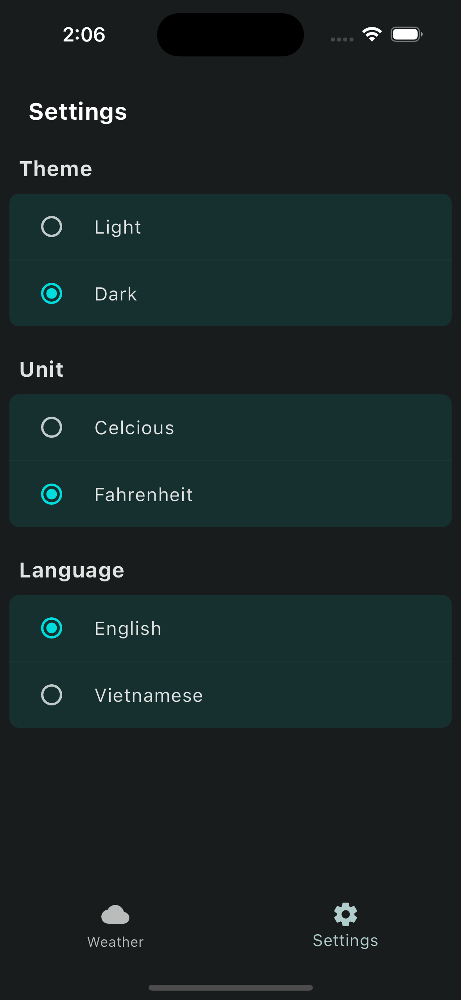

# Weather App

Flutter mobile app that fetches and displays current weather information for a given location.

<p align="center">
    
    
    
</p>

## Features

- Displays the current weather information according to the user's location or the location the user enters
- Dark and Light themes setting
- Change display unit setting
- Localization(en/vi)

## Services used:

- The app receives weather data from [OpenWeather](https://openweathermap.org/)
- Cities are searched using [Open-Meteo](https://open-meteo.com/en/docs/geocoding-api)

## Getting Started

To get a local copy up and running follow these simple example steps.

- Prerequisite: [Install Flutter](https://flutter.dev/docs/get-started/install)
- Flutter version: 3.13.7

1. To get started, clone the repo..

    ```sh
     git clone https://github.com/hoangcongminh/weather_app
    ```

2. Install packages.

    ```sh
     flutter pub get
    ```

3. Generate files

    ```sh
     flutter pub run build_runner build --delete-conflicting-outputs
    ```

4. Generate localization files

    ```sh
     flutter gen-l10n
    ```

5. Run project.

    ```sh
     flutter run
    ```
